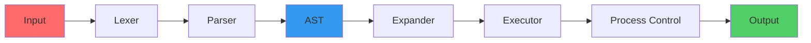

<div align="center">

TEST
# 🔥 Hellish Shell

### *A POSIX-like shell forged in the fires of 42 School*


**A compact, educational shell implementation that explores the intricate depths of UNIX internals**

[Features](#-features) • [Quick Start](#-quick-start) • [Architecture](#-architecture) • [Contributing](#-contributing) • [License](#-license)

---

</div>

## 🌟 Why "Hellish"?

Building a shell from scratch means diving into the **most challenging corners of UNIX**: complex parsing algorithms, variable expansion, process control, signal handling, and job management. It's a journey through computational hell — but one that forges deep understanding.

This project adheres to **42 School's rigorous coding standards** while implementing POSIX-like shell behavior.

---

## ✨ Features

<table>
<tr>
<td width="50%">

### 🧩 **Core Components**
- **Lexer & Parser** — Token stream to AST generation
- **Advanced Expander** — Variables, tilde, quotes, wildcards
- **Pipeline Engine** — Robust pipe and redirection handling
- **Signal Management** — Proper SIGINT, SIGTERM handling

</td>
<td width="50%">

### ⚡ **Advanced Features**
- **Custom Memory Allocator** — libmemalloc for granular control
- **Built-in Commands** — cd, echo, export, env, and more
- **Job Control** — Background/foreground process management
- **Glob Pattern Matching** — Wildcard expansion support

</td>
</tr>
</table>

---

## 🚀 Quick Start

```bash
# Clone with submodules
git clone --recursive git@github.com:Univers42/sh42.git
cd sh42

# Build the project
make

# Launch interactive shell
./hellish

# View help
./hellish --help
```

### 📖 Read the Manual

```bash
groff -Tutf8 -man docs/manual/man.1 | less -R
```

---

## 💻 Usage Examples

<table>
<tr>
<td>

**Simple Commands**
```bash
ls -la | grep srcs > out.txt
cat file.txt | wc -l
```

</td>
<td>

**Built-ins**
```bash
echo "Hello, World!"
cd ../projects
export PATH=$PATH:/usr/local/bin
```

</td>
</tr>
<tr>
<td>

**Pipelines**
```bash
ps aux | grep hellish | awk '{print $2}'
```

</td>
<td>

**Redirections**
```bash
echo "log entry" >> log.txt
./program 2>&1 | tee output.log
```

</td>
</tr>
</table>

---

## 🏗️ Architecture



### 📦 Project Structure

| Component | Description |
|-----------|-------------|
| **LIBMEMALLOC** | Custom memory allocator for learning and fragmentation control |
| **LEXER** | Tokenizes command-line input into meaningful units |
| **PARSER** | Constructs Abstract Syntax Tree from token stream |
| **EXPANDER** | Handles variable expansion, tilde expansion, and globbing |
| **EXECUTOR** | AST execution engine with builtin vs fork logic |
| **ROUTINE** | Classic REPL: Read → Execute → Print → Loop |
| **JOB CONTROL** | Background/foreground process management |

<details>
<summary><b>📂 Full Directory Tree (Click to expand)</b></summary>

```
.
├── 📄 docs
│   ├── manual
│   └── sys
├── 📋 incs
├── 📚 lib
│   ├── glob
│   ├── libarena
│   ├── libft
│   ├── liblex
│   ├── libmalloc
│   ├── libreadline
│   ├── libregexp
│   └── ... (more libraries)
├── 🔧 scripts
└── 💾 srcs
    ├── executor
    ├── expander
    ├── globbing
    ├── parser
    └── shell

108 directories total
```

</details>

---

## 🎯 Key Learning Objectives

- ✅ **Process Management** — fork, exec, wait, signal handling
- ✅ **File Descriptors** — pipes, redirections, dup2
- ✅ **Memory Management** — custom allocators, leak detection
- ✅ **Parsing Theory** — lexical analysis, syntax trees
- ✅ **POSIX Standards** — shell behavior specification
- ✅ **System Programming** — low-level UNIX APIs

---

## 🤝 Contributing

We welcome contributions! Here's how you can help:

1. **🍴 Fork** the repository
2. **🌿 Create** a feature branch (`git checkout -b feature/amazing-feature`)
3. **✍️ Commit** your changes (`git commit -m 'Add amazing feature'`)
4. **📤 Push** to the branch (`git push origin feature/amazing-feature`)
5. **🎉 Open** a Pull Request

### Code Standards

- Follow **42 School norm** (Norminette compliance)
- Keep commits **atomic** and well-documented
- Add **tests** for new features
- Update **documentation** as needed

---

## 📚 Resources

| Resource | Description |
|----------|-------------|
| [POSIX Shell Spec](https://pubs.opengroup.org/onlinepubs/9699919799/) | Official POSIX shell specification |
| [GNU Readline](https://tiswww.case.edu/php/chet/readline/readline.html) | Line editing library documentation |
| [glob.h Reference](https://docs.oracle.com/cd/E86824_01/html/E54772/glob.h-3head.html) | Glob pattern matching API |
| [shlex](https://rico-schmidt.name/pymotw-3/shlex/) | Python's shell lexer (reference) |

---

## 📝 License

This project is an educational endeavor created for **42 School**. See the `LICENSE` file for details.

---

## 🌟 Support

If you find this project helpful:

- ⭐ **Star** this repository
- 🐛 Report bugs via [Issues](https://github.com/Univers42/sh42/issues)
- 💬 Share feedback and suggestions
- 🔀 Fork and contribute improvements

---

<div align="center">

### Built with 💀 by 42 School students

**[View Repository](https://github.com/Univers42/sh42)** • **[Report Bug](https://github.com/Univers42/sh42/issues)** • **[Request Feature](https://github.com/Univers42/sh42/issues)**

---

*"In the depths of shell implementation, we find the essence of UNIX"*

</div>
