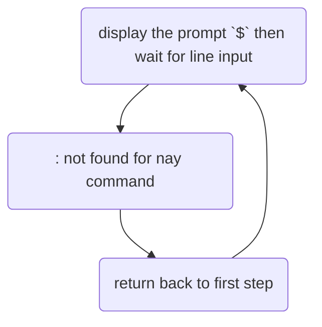

# REPL
a `REPL (read-Eval-Print Loop)` is an interactive loop that forms teh core of a shell.
it follows a repeating cycle.

1. Read: Display a prompt and wait for user input
2. Eval: Parse and execute the command
3. print: Display the output of error message
4. Loop: Return to step 1 and wait for the next command

This cycle continues indefinitely until the shell process is terminated

Our shell follow this same cycle:
1. Display the prompt `$`, then wait for a line of input.
2. Print `<command>: command not found` for any coammdn the user enters, with
    the previous stage.
3. Return to step 1

