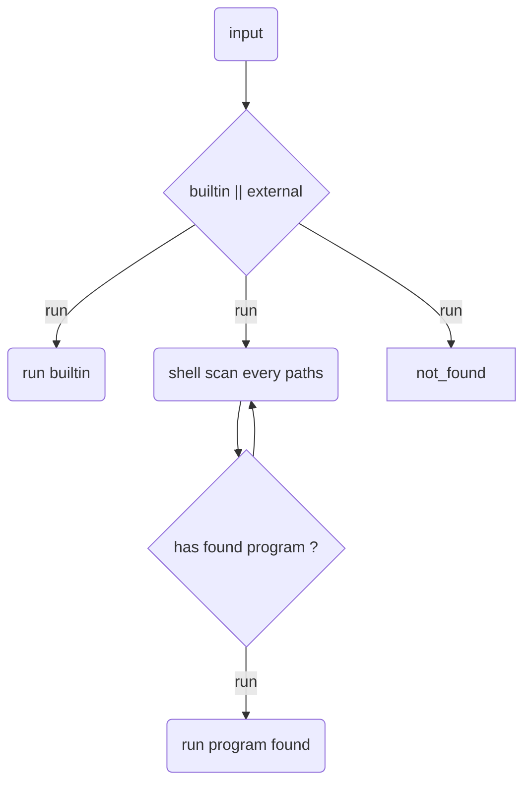

# Path environment Variable

The Path environment variable specifies a list of directories where the shell should look for executable programs.

for example, if the path is set to `/dir1:/dir2:/dir3`, the shell would search for executables in `/dir1`, then `/dir2` and finally `/dir3`, in that order.

# Searching for executables
When type receives a command input, our shell must follow these steps:

