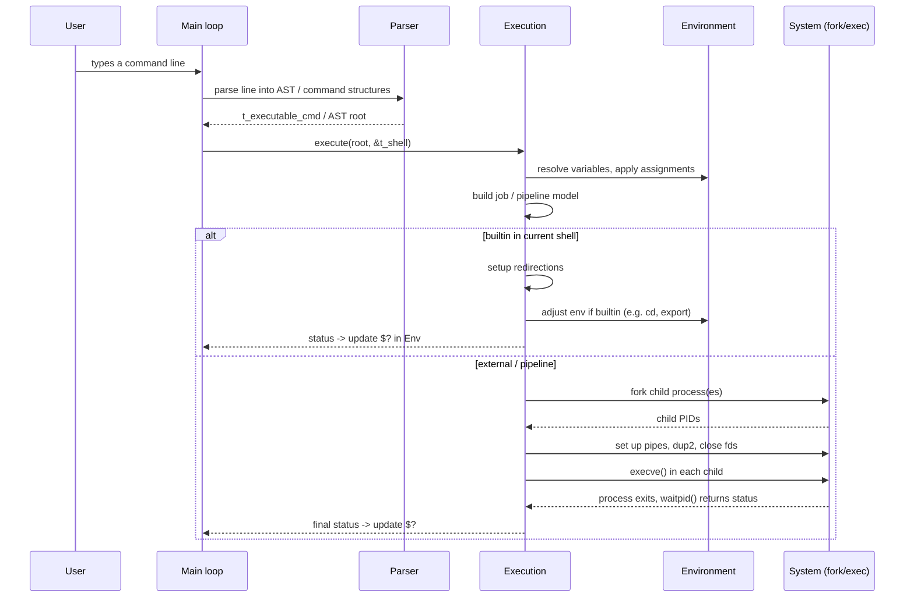

# Execution Module Documentation

This document explains, in human terms, how the **execution layer** of the shell is designed and how it interacts with the rest of the codebase. It focuses on ideas and data flow rather than implementation details.

The goal of the execution module is:

- Take a **parsed command line** (AST / command structures) produced by the parser,
- Use the current **shell state** (environment, working directory, options),
- And **run** what the user asked for:
  - builtins,
  - external programs,
  - pipelines, redirections, subshells, and command lists (`&&`, `||`, `;`).

It must do this **safely** (no leaks, correct closing of file descriptors, controlled forking) and **predictably** (well‑defined behavior even on errors).

---

## 1. High‑Level Picture

At a high level, execution sits in the middle of the shell:

- It receives **structured commands** from the *parsing* / *expansion* layers.
- It queries and updates the **environment** via the environment module.
- It interacts with the **builtins** module to run shell‑internal commands without forking when possible.
- It talks to the **system layer** to actually call `fork`, `execve`, `waitpid`, manipulate file descriptors, and handle signals.

Conceptually:

```mermaid
flowchart LR
    subgraph Core Shell State
        S[t_shell]
        E[Environment\n(t_vec_env)]
    end

    P[Parser / AST builder] -->|AST / commands| X[Execution module]
    X -->|lookup / mutation| E
    X -->|call| B[Builtins]
    X -->|fork/exec/wait| SYS[System layer]

    S --- E
    S --- X
```

- The **execution module** is the *orchestrator* that decides:
  - *What runs in the current process* (builtins that must affect the current shell, like `cd`, `export`, `exit`),
  - *What runs in a child process* (pipelines, external programs, subshells),
  - *How data flows* between them (redirections, pipes),
  - *How statuses* are propagated into `$?` and control constructs (`&&`, `||`).

---

## 2. Execution Pipeline – From Line to Processes

From the user perspective, execution starts when a full command line has been read and parsed. Internally, the execution pipeline can be summarized as:



Key ideas:

- **Parsing and expansion are separate**: the execution module assumes it receives a structured description of *what* to run, with variable expansion and quoting already resolved, or at least described enough for final decisions.
- **Execution builds a job model**: for example, a pipeline like `a | b | c` becomes a series of *process slots* connected by pipes.
- **Children are only created when necessary**: many builtins run *in the main shell process* to be able to modify the shell state.

---

## 3. Interactions with Other Modules

### 3.1 With the Environment module

The environment module provides:

- A structured environment vector (`t_vec_env`) held in `t_shell.env`,
- Lookup (`env_get`, `env_expand_*`),
- Mutation (`env_set`, `env_extend`, `env_apply_cmd_assigns`),
- Initialization helpers (`ensure_essential_env_vars`, `update_pwd_vars`).

Execution uses this in several ways:

- **Before running a command**:
  - Apply any **temporary assignments** (`VAR=val cmd`) so that the executed command sees the right environment.
  - Update variables that must reflect execution behavior (e.g. `_` for the last argument, sometimes `PWD` after `cd`).

- **When forking**:
  - Convert the in‑memory environment into the `char **envp` form needed by `execve()`, using `get_envp(state, exe_path)`.

- **After the command finishes**:
  - Update the shell’s `$?` variable via the environment module so that expansion of `$?` reflects the last exit status.

In short, execution does not manage raw environment strings. It delegates all environment logic to the environment module and uses it as the single source of truth.

### 3.2 With the Builtins module

The builtins module exposes shell‑internal commands such as `cd`, `export`, `unset`, `echo`, `exit`, etc.

The execution module must decide, for each command node:

- **Is this a builtin?**
- **Should it run in the current process or in a forked child?**

Design rules:

1. Builtins that **change shell state** (environment, working directory, shell options) must run in the **current shell process** when they are not part of a pipeline. Examples: `cd`, `export`, `unset`, `exit`.
2. When a builtin is part of a **pipeline**, it usually runs in a **child process** like any external command, because the data flow requires multiple concurrent processes.
3. The execution module uses a **dispatch table** or equivalent mechanism provided by the builtins module:
   - It looks up a command name,
   - Receives a pointer/handle to the builtin function if it exists,
   - Calls it with `t_shell *` and the argument list.

This design keeps builtins logically separated from the core execution machinery, while still allowing builtins to access and modify the shell state through well‑defined interfaces.

### 3.3 With the System layer (sys)

The system layer wraps low‑level system calls:

- `fork`, `execve`, `waitpid`, `pipe`, `dup2`, `close`, `signal` handling.

Execution relies on this layer to:

- **Create child processes** safely, with error reporting through the shell’s error facilities.
- **Build pipelines** by chaining file descriptors.
- **Apply redirections** by duplicating and closing file descriptors appropriately.
- **Wait** for processes and collect their exit statuses.

By funnelling system calls through a centralized `sys` layer, the code gets:

- Consistent error messages and error codes,
- A single place to adjust behavior for portability or debugging,
- Cleaner execution code that focuses on *what* needs to happen rather than the mechanics of each system call.

---

## 4. Internal Execution Logic: Commands, Pipelines, and Lists

### 4.1 Command types

From the execution module’s point of view, every piece of work it receives is one of a small set of **command forms**:

- **Simple command**: e.g. `ls -l`, `VAR=1 cmd`, `cd /tmp`.
- **Pipeline**: `cmd1 | cmd2 | ... | cmdN`.
- **Logical list**: `cmd1 && cmd2`, `cmd1 || cmd2`, `cmd1 ; cmd2`.
- **Subshell**: `(cd /tmp && ls)`.

The parser builds an AST or an equivalent tree of `t_executable_cmd` / list nodes representing these structures. The execution module walks this tree and applies rules for each node type.

### 4.2 Execution strategy, step by step

The generic strategy for a single top‑level command node is:

```mermaid
flowchart TD
    A[execute(node, shell)] --> B{node type?}

    B -->|Simple command| C[handle_simple_command]
    B -->|Pipeline| D[handle_pipeline]
    B -->|Logical AND/OR/;| E[handle_compound_list]
    B -->|Subshell| F[handle_subshell]

    C --> G[returns status]
    D --> G
    E --> G
    F --> G
```

Where each handler:

- Receives the shell state and the node description,
- Sets up the necessary environment / redirections / child processes,
- Returns an integer status code (0 = success, non‑zero = failure), which is then fed back to `$?` and to logical operators.

### 4.3 Simple commands

For a simple command, execution follows roughly this logic:

1. **Apply variable assignments** attached to the command (if any):
   - Some assignments affect only the environment of this command and its children,
   - Others become permanent in the shell’s environment, depending on shell rules and how the parser encoded them.
   - This is done with helpers like `env_apply_cmd_assigns`.

2. **Decide between builtin or external program**:
   - Check if the command name matches a builtin.
   - If builtin and not forced into a child (no pipeline/subshell constraints), run it in the current process.
   - Otherwise, prepare to fork and `execve` an external program.

3. **Handle redirections**:
   - For builtins in the current process, temporarily adjust file descriptors, run the builtin, then restore the original FDs.
   - For external commands, perform redirections in the child process before the `execve` call.

4. **Return status**:
   - Builtins: return the integer code they report.
   - External commands: return the exit status from `waitpid`.

### 4.4 Pipelines

A pipeline requires multiple processes that run concurrently and communicate through pipes. The module models a pipeline as an ordered list of *process slots*.

For a pipeline `A | B | C`:

1. Create N‑1 pipes for N commands.
2. For each command in the pipeline (left to right):
   - Fork a child process.
   - In the child, connect `stdin` and `stdout` to the appropriate pipe ends.
   - Apply the command’s redirections.
   - Decide builtin vs external; usually, even builtins in a pipeline run in the child.
   - Call `execve` or the builtin implementation and exit.
3. In the parent:
   - Close all pipe FDs that are no longer needed.
   - Wait for all children and collect their statuses.
   - Set the **pipeline status** (and thus `$?`) typically to the last command’s exit status.

The constraints here are mostly about **resource management**:

- Ensure every pipe end is closed in exactly one place.
- Avoid file descriptor leaks in both parent and children.
- Correctly propagate signals (e.g. SIGINT) to pipeline processes.

### 4.5 Logical operators and command lists

Logical operators (`&&`, `||`) and separators (`;`) do not directly create processes. Instead, they control **which subcommands execute and in what order** based on statuses:

- `cmd1 && cmd2`:
  - Execute `cmd1`.
  - Only if `cmd1` returns success (status 0), then execute `cmd2`.

- `cmd1 || cmd2`:
  - Execute `cmd1`.
  - Only if `cmd1` returns failure (non‑zero status), then execute `cmd2`.

- `cmd1 ; cmd2`:
  - Always execute `cmd1`, then `cmd2`, regardless of status.

The execution module implements this by recursively calling `execute` on child nodes and checking the returned status.

### 4.6 Subshells

A subshell `( ... )` is handled by:

- Forking a new child process.
- In the child:
  - Execute the enclosed command tree using the same execution machinery,
  - But any changes to environment, directory, or shell state are **not visible** to the parent.
- The parent only sees the subshell’s exit status.

This mirrors POSIX shell behavior and isolates complex command groups without polluting the main shell state.

---

## 5. Data and Resource Management

Designing the execution module safely is largely about **controlling ownership** and **closing what you open**.

### 5.1 Environment safety

- The execution module never directly manipulates raw `char **envp` from the OS.
- Instead, it always goes through `t_shell.env` and uses helper functions to:
  - Add or change entries (`env_set`, `env_create`),
  - Lookup variables (`env_get`, `env_expand_n`),
  - Build temporary `envp` for `execve` (`get_envp`).

This avoids double frees and dangling pointers, because **there is a single owner of each environment string**, the environment vector.

### 5.2 File descriptor discipline

- Redirections and pipelines require opening files, creating pipes, and redirecting standard FDs.
- The execution module follows a simple rule: *every file descriptor that is opened is either correctly handed off to a child process or closed in the parent*.
- For builtins executing in the current shell process, the module must:
  - Save the original FDs (e.g., by duplicating them),
  - Apply redirections,
  - Run the builtin,
  - Restore the saved FDs, even in the presence of errors.

### 5.3 Process lifecycle

Execution manages process lifecycles through a small, consistent pattern:

1. **Create**: `fork` a new process only when necessary.
2. **Configure**: in the child, set up FDs, environment, and signal handlers.
3. **Run**: call `execve` or the builtin implementation.
4. **Reap**: in the parent, `waitpid` on every child that was forked.
5. **Propagate status**: translate raw wait status into a shell status code and store it as `$?`.

This pattern is the same for single external commands, pipelines, and subshells, which simplifies understanding and maintenance.

### 5.4 Error handling

The execution module never silently ignores system errors. Instead, it:

- Relies on the system layer to report descriptive error messages,
- Ensures partial setups are rolled back (closing partially created pipes, restoring FDs),
- Propagates non‑zero statuses upward so that scripts and interactive users can see failures through `$?` and conditional constructs.

---

## 6. Mermaid Diagrams: Overview of Execution Flow

### 6.1 From input to completed command

```mermaid
flowchart TD
    A[User types command line] --> B[Readline / input loop]
    B --> C[Parser builds AST / command objects]
    C --> D[Executor receives root node]
    D --> E{Node type?}
    E -->|Simple| F[Execute simple command]
    E -->|Pipeline| G[Execute pipeline]
    E -->|List (&&, ||, ;)| H[Execute list]
    E -->|Subshell| I[Execute subshell]
    F --> J[Status -> update $?]
    G --> J
    H --> J
    I --> J
    J --> K[Prompt next command]
```

### 6.2 Process creation and envp management

```mermaid
flowchart LR
    subgraph Parent Shell
        S[t_shell]
        V[t_vec_env env]
        EMod[Environment module]
        Exec[Execution module]
    end

    subgraph Child Process
        Child[Program / builtin]
    end

    V <--> EMod
    S --- V
    S --- Exec

    Exec -->|build envp| EMod
    EMod -->|get_envp()| Exec
    Exec -->|fork| Child
    Exec -->|pass envp to execve| Child
```

This diagram emphasizes that the actual `char **envp` is built **on demand** for each exec and is derived from the canonical `t_vec_env` in the parent.

---

## 7. Expected Behavior and Design Goals

The execution module is designed with the following behavioral goals in mind:

1. **POSIX‑like semantics**:
   - Pipelines, redirections, and logical operators behave like in standard shells.
   - Environment variables and `$?` follow familiar conventions.

2. **Predictable environment behavior**:
   - The environment seen by a command is precisely determined by:
     - The parent `envp` at shell startup,
     - Changes applied via builtins (`export`, `unset`, `cd`, etc.),
     - Temporary assignments for that command.

3. **Minimal surprises for builtins**:
   - Builtins that must affect the current shell state are executed in‑process when possible, but still integrate cleanly into pipelines and subshells when required.

4. **Safety and robustness**:
   - No uncontrolled leaks of file descriptors or heap memory.
   - Clear discipline about which process owns what resources.
   - Uniform error handling via the system layer.

5. **Extensibility**:
   - New control constructs or builtins can be added by extending the command representation and the execution dispatch logic, without rewriting the entire engine.

---

## 8. How to Read and Extend the Execution Code

When working in `src/execution/`:

- Start by identifying **which kind of command node** a function handles (simple, pipeline, list, subshell).
- Trace how it:
  - Interacts with the environment module (`env_*` functions),
  - Calls builtins (via the builtins interface),
  - Uses system helpers (forking, pipes, dup2, waitpid).
- Keep in mind the invariants:
  - `t_shell.env` remains the single source of truth for environment.
  - Every opened FD must be either closed or transferred to a child.
  - Status codes bubble up and always end up in `$?`.

If you follow these principles, new features should integrate cleanly with the existing design without breaking the guarantees described above.